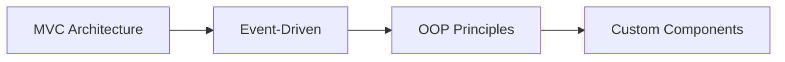
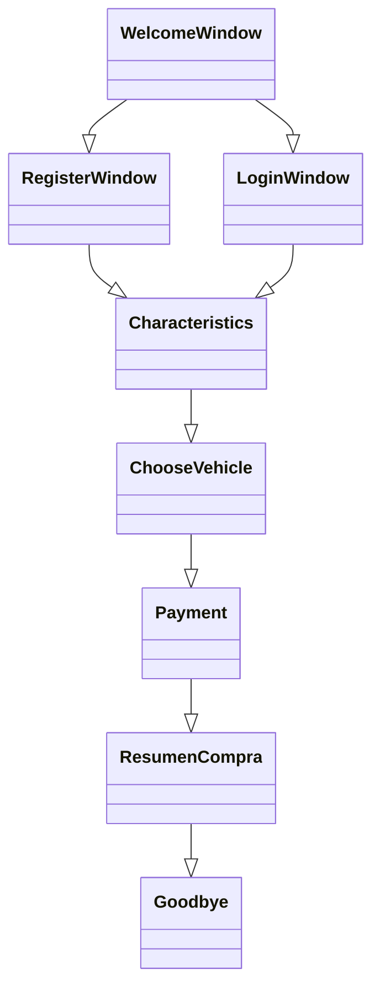

# 🚗 LuxeWheels - Premium Car Rental System

<div align="center">


[](https://www.java.com/)
[](https://docs.oracle.com/javase/tutorial/uiswing/)
[](https://www.oracle.com/java/technologies/downloads/)
[](LICENSE)

[Features](#features) · [Installation](#installation) · [Documentation](#documentation) · [Contributing](#contributing)

</div>

## 📋 About The Project

LuxeWheels is a sophisticated Java-based car rental management system designed to provide a premium booking experience. This desktop application streamlines the vehicle rental process with real-time pricing, insurance options, and automated discount calculations.

### 🌟 Key Highlights
- 💼 Professional-grade rental management solution
- 🎨 Modern and intuitive Swing GUI
- 🔄 Real-time pricing and availability
- 🛡️ Built-in insurance options
- 💰 Automatic discount system

## ⚙️ Built With

### Core Technologies
<table>
<tr>
    <td align="center" width="96">
        
        <br>Java SE 8+
    </td>
    <td align="center" width="96">
        
        <br>Swing GUI
    </td>
    <td align="center" width="96">
        
        <br>Git
    </td>
</tr>
</table>

### Architecture & Patterns


### Key Components
- **Java Development Kit (JDK) 8+**
  - Core programming language
  - Collections Framework
  - Stream API
  - Date/Time API

- **Swing Framework Components**
  - JFrame, JPanel
  - JButton, JLabel
  - JTextField, JPasswordField
  - JComboBox, JRadioButton
  - Custom BackgroundPanel

- **Additional Technologies**
  - Event Handling System
  - Image Processing
  - Layout Management
  - Form Validation

## 🚀 Getting Started

### Prerequisites
```markdown
- Java JDK 8 or higher
- Any Java IDE (IntelliJ IDEA, Eclipse, NetBeans)
- Git
```

### Installation

1. Clone the repository
```bash
git clone https://github.com/yourusername/LuxeWheels.git
```

2. Navigate to project directory
```bash
cd LuxeWheels
```

3. Compile the project
```bash
javac paquete/*.java
```

4. Run the application
```bash
java paquete.WelcomeWindow
```

## 🎯 Features

### User Interface
- Responsive design
- Custom background panels
- Intuitive navigation
- Real-time feedback

### Vehicle Management
- Multiple categories
- Dynamic pricing
- Real-time availability
- Detailed specifications

### Booking System
- User authentication
- Date validation
- Location selection
- Payment processing
- Insurance options

## 📸 Screenshots

<div align="center">


</div>


## 🤝 Contributing

We welcome contributions! Follow these steps:

1. Fork the project
2. Create your feature branch
```bash
git checkout -b feature/AmazingFeature
```
3. Commit your changes
```bash
git commit -m 'Add some AmazingFeature'
```
4. Push to the branch
```bash
git push origin feature/AmazingFeature
```
5. Open a Pull Request

## 📘 Documentation

For detailed documentation, please visit our [Wiki](link-to-wiki).

### Class Structure


## 📝 License

Distributed under the MIT License. See `LICENSE` file for more information.


---

<div align="center">
  
⭐️ If you find this project useful, please consider giving it a star!

[](https://github.com/yourusername/LuxeWheels/stargazers/)

</div>
